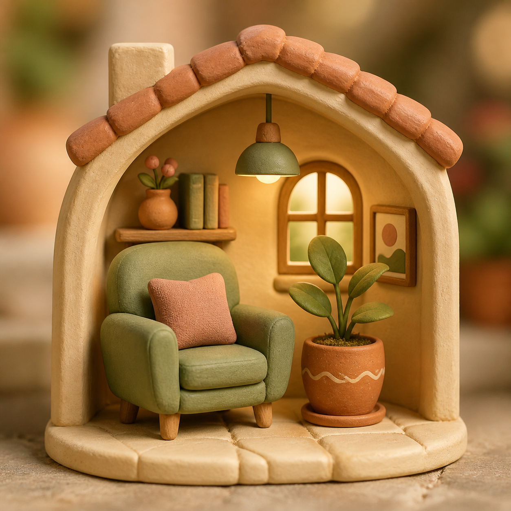

# Nook & Nest

A cozy 3D apartment planner where you and your browser's AI agent can design, furnish, and personalize a home together.

[Open the live planner](https://nook-and-nest.fwad101.chatgpt.site/) · [WebMCP integration](docs/webmcp.md)



## The idea

Nook & Nest started because a friend was looking for a rental apartment and wanted to work out how to furnish it before moving in. It combines measured room planning with the feel of decorating a cozy miniature world. Built with help from Codex, it supports both hands-on editing and agent-proposed arrangements.

## What you can do

- Draw measured floor regions, create multiple floors, and add walls, doors, windows, and stairs.
- Browse 216 furniture and decor pieces with original editable Blender models, exported GLBs, and preview images.
- Preview placement before confirming, rotate pieces, adjust dimensions, and recolor individual materials.
- Place televisions on media benches and small decorations on tables or usable shelf levels.
- Choose wall and floor finishes, kitchen worktops and backsplashes, rugs, and optional outdoor scenery.
- Use cozy, top-down, and dollhouse views, close-up zoom, undo/redo, JSON backup, and share links.
- Keep builds locally, or explicitly save private online snapshots on the hosted site.

## Try the WebMCP demo

Open the live planner in a browser that supports native WebMCP site tools. Open **Agent** in the planner. Send your request to the **browser agent's chat**, not the website: Nook & Nest's Agent panel controls permissions and reviews proposals; it does not contain a chatbot or run its own language model.

Example prompt:

> Use Nook & Nest's WebMCP tools to inspect my apartment and search the catalog. Furnish a cozy living room with a sage sofa, cream rug, wood coffee table, TV stand, TV, and a plant. Keep furniture inside the room, leave room to walk, and place the TV on the stand. Stage the arrangement for my review without applying it. If native WebMCP tools are unavailable, tell me rather than substituting mouse clicks.

Review the preview and choose **Apply design** or **Discard**. Nothing in a staged proposal is saved until it is applied. **Let my agent apply designs** explicitly enables direct application for the current project and tab; reloading or changing projects revokes that permission. **Pause agent tools** stops access. An applied arrangement is one undo step.

The seven native tools are:

| Tool | Purpose |
| --- | --- |
| `nook_get_apartment` | Read the current apartment, dimensions, placements, supports, and revision. |
| `nook_search_catalog` | Find furniture, dimensions, mounting types, material slots, and finishes. |
| `nook_stage_design` | Validate and preview an ordered batch of edits without saving. |
| `nook_apply_design` | Apply the exact proposal, only with direct-edit permission. |
| `nook_discard_design` | Remove an unsaved proposal. |
| `nook_history` | Undo or redo with revision and permission checks. |
| `nook_set_view` | Inspect a floor, view, or selected piece. |

Tools register through `document.modelContext.registerTool`. No API key or separate MCP server is required. Browsers without WebMCP retain manual editing. The tools do not expose accounts, other saved projects, online saves, or public sharing. Full contracts and safety details are in [docs/webmcp.md](docs/webmcp.md).

## Run locally

Use Node.js 22.14 or later in the Node 22 line, and npm. The existing GLBs and previews are included, so Blender is not needed just to run the editor.

```sh
npm ci
npm run dev
```

Open the local address printed by Vite. In Windows PowerShell, use `npm.cmd` if script execution policy blocks `npm.ps1`.

The local Vite server supports the editor and device-local saves. Hosted authentication and online project storage require the Sites dispatcher and database bindings; they are not supplied by the development server. Native agent tools also require a WebMCP-capable browser environment.

## Checks and build

```sh
npm run check
npm test
npm run test:sites
npm run build
node scripts/verify-release.mjs
```

The build emits `dist/client/`, a Worker entry at `dist/server/index.js`, and generated hosting/migration metadata. See [private project saves](docs/private-project-saves.md) for the existing deployment's database packaging requirements. The checked-in `.openai/hosting.json` identifies the original hosted project; a fork must provision its own hosting project and identity bindings rather than reuse that deployment identity. Never trust client-supplied identity headers when adapting the Worker to another host.

## Project layout

- `src/` — React interface, plan state, validation, catalog, and Babylon.js scene controller.
- `src/webmcp.ts`, `src/agentDesign.ts`, `src/agentSchema.ts` — native tool registration and validated batch proposals.
- `assets-source/blender/` — editable furniture and environment source models.
- `assets-source/art/`, `assets-source/textures/` — artwork and texture sources.
- `public/models/` — browser-ready GLBs, catalog previews, and model metadata.
- `tools/blender/` — model construction, export, and preview-rendering scripts.
- `worker/`, `db/`, `drizzle/` — hosted private project storage and migrations.
- `tests/` — editor, geometry, placement, persistence, and WebMCP tests.
- `docs/` — design research, integration notes, and release checks.

To rebuild models on Windows with Blender installed, run `tools/blender/build-models.ps1`. Model generation can overwrite generated Blender/GLB assets, so preserve any hand-edited versions first. Preview rendering accepts model IDs, for example:

```sh
blender --background --python tools/blender/render_catalog.py -- sofa
```

## Scope and asset notes

This is a visual planning tool, not architectural, structural, electrical, plumbing, or building-code advice. Footprint and height warnings are conservative layout checks, not a guarantee of circulation or installation clearance. Online snapshots are explicit saves, not real-time collaboration.

The visual direction is inspired by cozy miniature-world games, but the furniture models and artwork used in the app were created for this project. Research references and development comparison images are not part of the original asset collection and remain attributable to their respective owners. Third-party dependencies retain their own licenses. No general open-source license has been selected for the project source and original assets.
